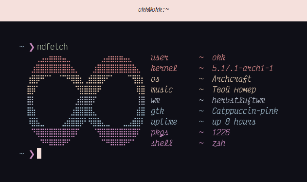

# ndefetch
a fetch that features the neurodiversity symbol


### usage
- just run the script

### installation
- clone this repo
- change the script permissions (```sudo chmod +x ~/PATH/TO/SCRIPT```)
- move the script to usr/bin (```sudo mv ~/PATH/TO/SCRIPT usr/bin```)
